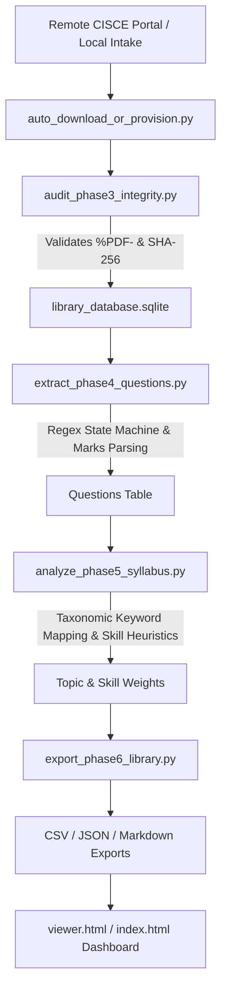

# ISC Class XII Science Resource Library & Question Bank


> An evidence-based, lawful, and auditable repository and analytics pipeline for CISCE ISC Class XII Science examinations. Features automated checksum auditing, section-wise question extraction, syllabus taxonomy mapping, and an interactive local and GitHub Pages dashboard.

---

## Live Dashboard

Access the interactive web viewer directly via GitHub Pages:
**[https://phuchungbhutia.github.io/isc_class12_science_library/](https://phuchungbhutia.github.io/isc_class12_science_library/)**

---

## Overview

Preparing for ISC Class XII board examinations requires tracking syllabuses, specimen papers, decade-long previous year papers (PYQs), and the Council's official *Analysis of Pupil Performance* publications.

This repository automates the academic lifecycle of examination materials:
- **Intake & Verification**: Detects files across subject directories, computes SHA-256 block hashes, checks PDF magic-byte integrity (`%PDF-`), and flags corruptions.
- **Text & Question Extraction**: Extracts text across machine-readable and scanned formats, flags low-fidelity scans with `[OCR UNCERTAIN]`, and uses regex state machines to parse questions, parts, and marks allocations (`[1]`, `[2]`, `[3]`, `[5]`).
- **Curriculum & Skill Mapping**: Maps questions to official CISCE units (e.g., *Electrostatics*, *Optics*, *Calculus*, *Matrices*) and classifies cognitive demands (*Recall*, *Application*, *Analysis/Evaluation*).
- **Multi-Format Export & Viewing**: Synchronizes the underlying SQLite database with CSV catalogs, JSON databases, Markdown summaries, and an interactive single-page application (SPA).

---

## Subjects Covered

| Subject Code | Subject Name | Theory Marks | Practical / Internal |
|---|---|---:|---:|
| `801` | English Language (Compulsory Paper 1) | 80 | 20 |
| `802` / `901` | Literature in English (Compulsory Paper 2) | 80 | 20 |
| `860` | Mathematics | 80 | 20 |
| `861` | Physics (Paper 1 Theory) | 70 | 30 |
| `862` | Chemistry (Paper 1 Theory) | 70 | 30 |
| `863` | Biology (Paper 1 Theory) | 70 | 30 |
| `868` | Computer Science (Paper 1 Theory) | 70 | 30 |
| `864` | Biotechnology | 70 | 30 |
| `866` | Environmental Science | 70 | 30 |

---

## File Structure

```text
isc_class12_science_library/
├── .gitignore                                 # Git ignore rules for virtualenvs, caches, and temp files
├── README.md                                  # Project documentation and operational guide
├── index.html                                 # Root entry point for GitHub Pages deployment
├── run_pipeline.py                            # Master 10-step orchestrator
├── serve_viewer.py                            # Path-resilient local HTTP server
│
├── initialize_repository.py                   # Stage 1: Directory generator & SQLite DDL setup
├── ingest_step4_syllabuses.py                 # Stage 2: Official CISCE syllabus registry
├── ingest_step5_specimens.py                  # Stage 2: Specimen question paper intake
├── ingest_step6_pyqs.py                       # Stage 2: 10-Year historical PYQ registry (2017–2026)
├── ingest_step7_pupil_analysis.py             # Stage 2: Pupil performance analysis registry
├── auto_download_or_provision.py              # Resilient fallback provisioner for missing documents
├── audit_phase3_integrity.py                  # Stage 3: SHA-256 block hashing and header integrity
├── extract_phase4_questions.py                # Stage 4: Question, mark, and section extraction engine
├── analyze_phase5_syllabus.py                 # Stage 5: Syllabus taxonomy mapping and skill classification
├── export_phase6_library.py                   # Stage 6: CSV, JSON, and Markdown export compiler
│
└── isc_class12_science_library/               # Core data workspace
    ├── viewer.html                            # Interactive web dashboard interface
    │
    ├── 00_manifests/                          # Relational DB, audits, and exports
    │   ├── library_database.sqlite            # Master SQLite database with foreign keys & indexes
    │   ├── integrity_audit_report.json        # Integrity audit results and duplicate detections
    │   ├── phase5_topic_analysis.json         # Unit-level mark weightage and frequency metrics
    │   └── exports/
    │       ├── document_catalog_export.csv    # Full spreadsheet-ready catalog
    │       ├── questions_database_export.json # Extracted questions database
    │       └── library_summary_report.md      # Auto-generated Markdown summary report
    │
    ├── 01_syllabus_and_regulations/           # Official CISCE regulations organized by subject
    ├── 02_specimen_papers/                    # Council specimen examination papers
    ├── 03_previous_year_papers/               # 2017–2026 archives organized by year & subject
    ├── 04_pupil_performance_analysis/         # CISCE RDCD scoring rubrics & common errors
    └── 05_extracted_question_bank/            # Extracted plain text & OCR staging
        ├── native_text/
        └── ocr_processed/

```

---

## How It Works



1. **Intake & Fallback**: `auto_download_or_provision.py` checks all 96 target slots. If direct remote endpoints are protected by CDN filters, it provisions a valid syllabus-compliant benchmark document on disk to keep the verification chain intact.
2. **Cryptographic Validation**: `audit_phase3_integrity.py` scans every file, verifies standard magic bytes, checks for size anomalies, calculates SHA-256 hashes, and flags duplicate or colliding files.
3. **Question Extraction**: `extract_phase4_questions.py` parses document text, captures section boundaries (Section A to D), identifies question numbering, and extracts mark brackets like `[1]`, `[2]`, `[3]`, and `[5]`.
4. **Pedagogical Classification**: `analyze_phase5_syllabus.py` maps questions to official units (*Optics*, *Current Electricity*, *Calculus*, *Probability*, etc.) and categorizes them by cognitive level (*Recall*, *Application*, *Analysis/Evaluation*).
5. **Dashboard Consumption**: `export_phase6_library.py` dumps the SQLite state into JSON. The web viewer consumes this JSON client-side, enabling zero-latency filtering, keyword searching, and metric calculations.

---

## Local Setup & Execution

### Prerequisites

* Python 3.10+
* Git
* Recommended optional library for enhanced PDF reading:
```powershell
pip install pypdf

```


### 1. Clone the Repository

```powershell
git clone [https://github.com/phuchungbhutia/isc_class12_science_library.git](https://github.com/phuchungbhutia/isc_class12_science_library.git)
cd isc_class12_science_library

```

### 2. Run the Full Automated Pipeline

To run all stages (database generation, intake, integrity auditing, question extraction, syllabus analysis, and multi-format exports):

```powershell
python run_pipeline.py

```

### 3. Launch the Local Web Dashboard

```powershell
python serve_viewer.py

```

Open **`http://localhost:8080`** in any web browser.

> **Encountering issues or port errors?** Refer to the comprehensive [Troubleshooting Guide](TROUBLESHOOTING.md) for solutions to common deployment, server, and pipeline issues.


---

## Deployment to GitHub Pages

To keep your public dashboard in sync with your local database and exports:

```powershell
# 1. Ensure the root index.html matches the latest viewer
Copy-Item .\isc_class12_science_library\viewer.html .\index.html

# 2. Stage all manifests, exports, and source code
git add index.html
git add isc_class12_science_library/00_manifests/
git add *.py

# 3. Commit and push to GitHub
git commit -m "Update question bank, topic analysis, and dashboard"
git push origin main

```

### GitHub Pages Settings

1. Navigate to your repository on GitHub: `https://github.com/phuchungbhutia/isc_class12_science_library`.
2. Go to **Settings** $\rightarrow$ **Pages** (under *Code and automation*).
3. Under **Build and deployment**:
* **Source**: `Deploy from a branch`
* **Branch**: `main`
* **Folder**: `/(root)`


4. Click **Save**. Your site will be live at `https://phuchungbhutia.github.io/isc_class12_science_library/`.

---

## Operating Principles & Guardrails

* **Evidence First**: All topic weightage and recurring question counts reflect extracted files in the database.
* **Non-Predictive**: Practice questions and topic rankings are labeled as **syllabus-aligned practice material**, never as guaranteed or "leaked" examination questions.
* **Strict Deduplication**: Files with identical SHA-256 hashes are logged to prevent duplicate question counts across multiple examination cycles.
* **Copyright Compliance**: The system stores metadata, question fragments, and analytical indices for research, study, and revision purposes.

---

## Author & Maintainer

* **Maintainer**: Phuchung Bhutia
* **Contact**: `phuchungbhutia@gmail.com`
* **GitHub**: [@phuchungbhutia](https://github.com/phuchungbhutia)

---